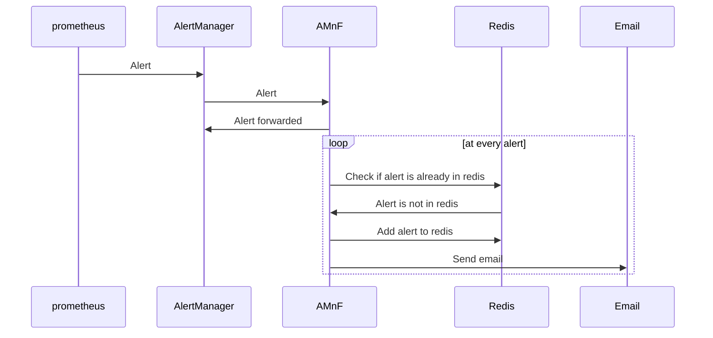

# alertmanager-notifications-forwarder

## Description

AMnF will forward any alert notification from an AlertManager.

It uses a Redis instance to be mindful if the alert has already been sent or not.

It will also mind if the alert has been resolved and will delete the alert from the Redis instance after a certain amount of time.

## Vectors

| Input | Description |
|-------|-------------|
| AlertManager | AlertManager notification are received as a webhook POST and will be processed |

| Output | Description |
|--------|-------------|
| Email | Email will be sent to the recipient when an Alert is firing or resolved |

## TODO

- [ ] Handle config file from config.yaml or config.yml
- [ ] TTL for alerts to delete alert if AlerManager has not repeated the alert
- [ ] Handle multiple SMTP servers
- [ ] Handle multiple SMTP recipients
- [ ] Able to use different templates for different alerts (based on labels or something else)
- [ ] Create chart deployment for Kubernetes
- [ ] Break the code into multiple files
- [ ] Add tests
- [ ] Automate documentation with mkdocs and or godoc

## Ideas

- [ ] Store the alert object history
  - That can be done by storing the alert object in another DB so we leave Redis for the caching state. Using an object DB like MongoDB or a lighter NoSQL DB like redisJSON (to explore)
  - Can be used to create regular reports based on different criteria (time, type of alert, etc) and send them to the user through email (or other)
- [ ] Add a web interface to see the alert history

## Configuration

Configuration can be passed down as environment variables or as a config file.

### config file

### Environment variables

| Variable | Description | Default |
|----------|-------------|---------|
| APP_PORT | Application port | 9847 |
| REDIS_HOST | Redis host | localhost |
| REDIS_PORT | Redis port | 6379 |
| SMTP_HOST | Remote SMTP host | localhost |
| SMTP_PORT | Remote SMTP port | 587 |
| SMTP_USERNAME | Remote SMTP username | username |
| SMTP_PASSWORD | Remote SMTP password | password |

## Diagram

