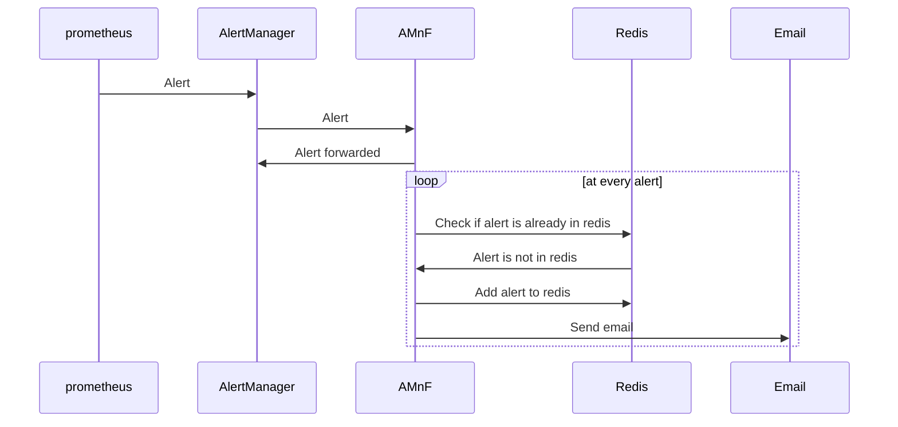

# alertmanager-notifications-forwarder

## Description

AMnF will forward any alert notification from an AlertManager
It use a redis instance to be mindfull if the alert as already been sent or not.
It will also mind if the alert has been resolved and will delete the alert from the redis instance after a certain amount of time.

## Configuration

### Environment variables

| Variable | Description | Default |
|----------|-------------|---------|
| REDIS_HOST | Redis host | localhost |
| REDIS_PORT | Redis port | 6379 |
| APP_PORT | Application port | 9847 |

## Diagram

